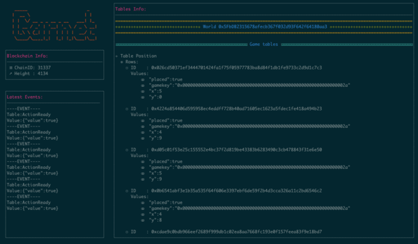
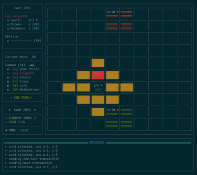
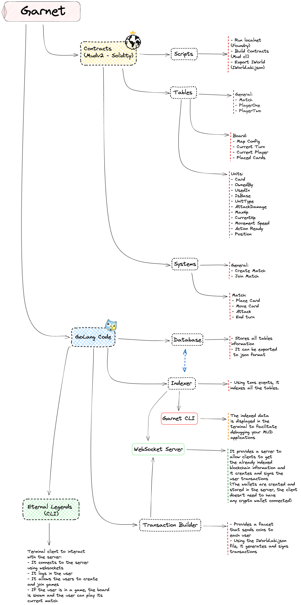

# Garnet

Autonomous Worlds hackathon entry.

- Garnet: is a custom indexer and backend code running on top of MUDv2.

  

- Eternal Legends is the example game:

  - Eternal Legends, a blockchain-based turn-based tactical game, combines MUD2, Solidity, and GoLang. Players select 3 heroes to protect their castles in battles fought on an ASCII graphical interface. Destroying the opponent's base leads to victory.

    

## Requirements

- Go 1.19

To execute the MUD's scripts it's also required:

- Foundry toolkit
- Pnpm

The `Makefile` assumes that you have `nvm` as your node version handler and that it's installed at `/opt/homebrew/opt/nvm/nvm.sh`.

If you have `pnpm` installed globally you can remove `source /opt/homebrew/opt/nvm/nvm.sh && nvm use v18.12.0 &&` from the `Makefile`.

- Clone and install dependencies:

```sh
git clone https://github.com/bocha-io/garnet
make init-contracts
```

## How to run it

- We need to run a local blockchain to deploy the contracts:
  - `make run-localnet`. It runs a local blockchain using `foundry`
- Compile and deploy your contracts:
  - `make contracts`. It runs the `mud-cli` in the contracts folder (`contracts-builder/contracts`), deploys them to the local blockchain, and copies the `IWorld.abi.json` file into the `Go` codebase.
- Run the indexer/server:
  - `make run-indexer`. It connects to the local blockchain and requests all the events related to MUD's transactions, parses those events and registers everything in an in-memory database.
    - The indexer also hosts a WebSocket server so clients can connect to it.
    - The WebSocket can create and send transactions to the blockchain.
- Run the client:
  - `make run`. It runs the client, it expects the username and password as arguments:
    - `make run-p1`. It runs the client but with the user1 credentials already set.
    - `make run-p2`. It runs the client but with the user2 credentials already set.
    - The client gets updates using a WebSocket, when it needs to interact with the blockchain it just sends a message to the WebSocket and the backend will generate and sign the transaction for the current user.

## Game Rules

- The board is a 10x10 square.
- Each player has a base with 10 health points.
- At the start of the game, the player has 5 Mana available. After each turn the total mana available increases by one, up to 15. (The mana leftovers are not carried to the next turn)
- Each player has 6 different types of units.
- Each player can summon up to 3 units, each summon has a cost of 3 Mana. The unit can only be placed in the same rows as the player's base.
- Move a unit has a cost of 2 Mana, the distance that you can move a unit is determined by the Movement speed of that unit.
- Each unit can attack once every turn, after striking the unit can no longer move or attack until the next turn.
- When a base health point reaches 0, the game ends.

## How it works?

There is a diagram at the end of this file with all of the components.

- The game logic was written using Mud's v2 lib.
- The solidity contracts get deployed using `mud-cli`
- Garnet:
  - Indexer: It reads the information from the blockchain using each block's events.
  - Database: It stores all the world's information in an in-memory structure.
  - WebSocket: It allows any client to get the already processed information and allows the creation, signing, and broadcasting of transactions.
  - TxBuilder: It handles all the wallet creation, contract interactions, tx creation, signatures, and broadcasting. It also provides a faucet to get coins.
- Eternal Legends:
  - It connects to the backend using WebSockets
  - It allows the user to create new games.
  - It displays all the games to the user, so the user can join to a game.
  - It displays the board status and allows users to interact with the game.

## Future developments

### Game

- Add unit boosters (like hp and dmg) that will spawn in random places every X turns.
- Add one special active ability to each unit (dmg).
- Add one passive ability to each unit (like 1 free movement each turn).

### Backend

- Add tests for the indexer.
- Add support for MUD's ephemeral events.
- Handle all the WebSocket possible errors.
- Instead of hardcoding the WorldID, it should be a parameter.

### Client

- Create a Unity client to connect to the backend and display the information with better graphics.

### Core

- Users just use their wallets to `create` and `join` matches.

- `Create` and `Join` matches transactions will delegate power to an `admin wallet` to send transactions representing each user (this wallet will be unique to each Match and controlled by the backend).

- Instead of reading events from the blocks, we are going to predict the events using the `Mempool` transactions.

- The admin wallet will send all the transactions related to a Match so the order will be deterministic (it will be controlled by the wallet's nonce).

- We control the wallet so we can resend transactions in case something fails to execute when included in a block.

- Why? Reading from the `Mempool` will move all the predictions from the client code to the backend code, and the predictions will be broadcasted to all the clients connected instead of just being executed to the player that sent the transaction.

## Current structure



## Demo


